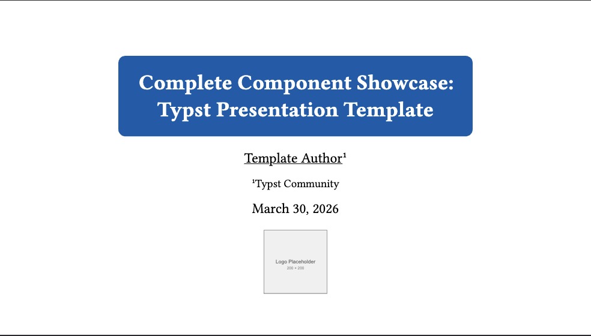
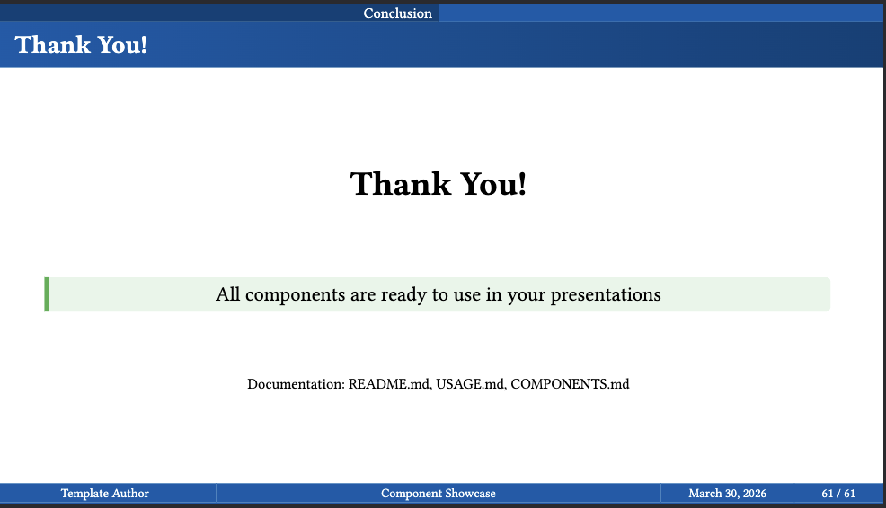
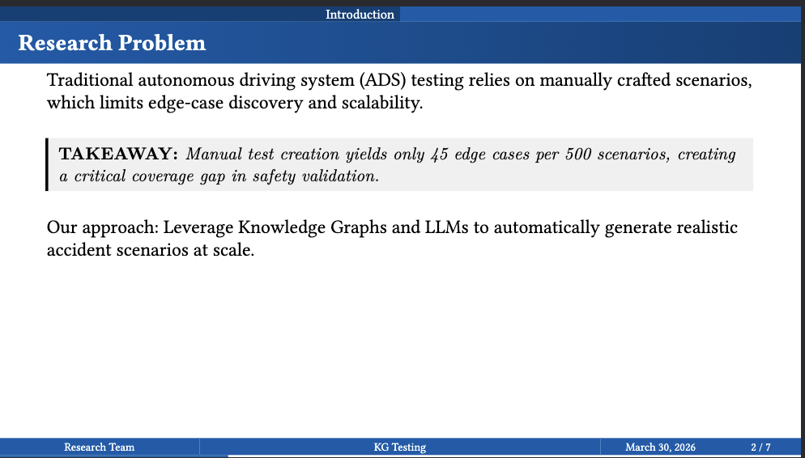
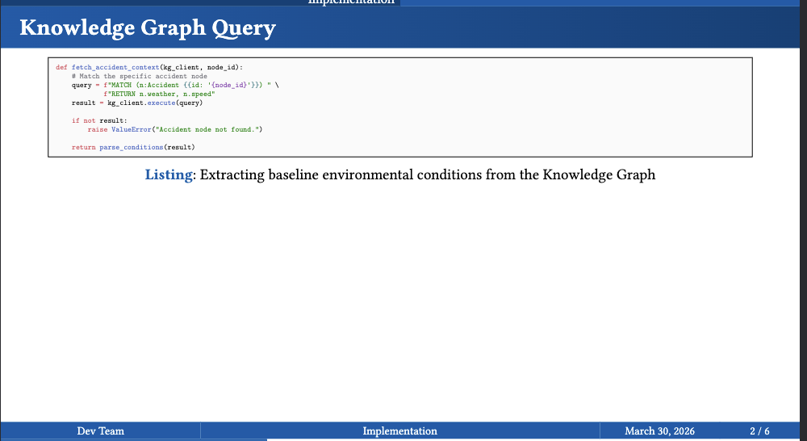
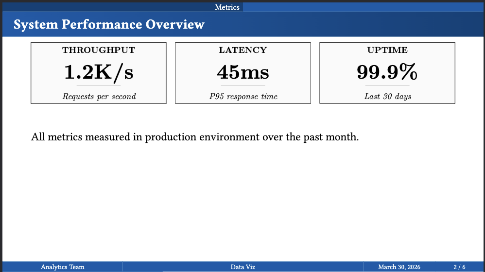
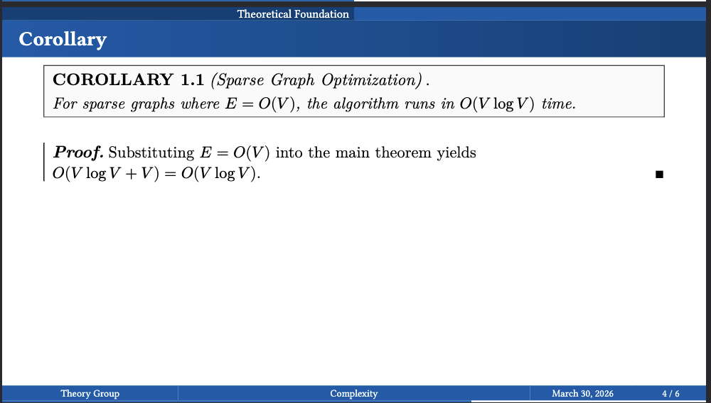
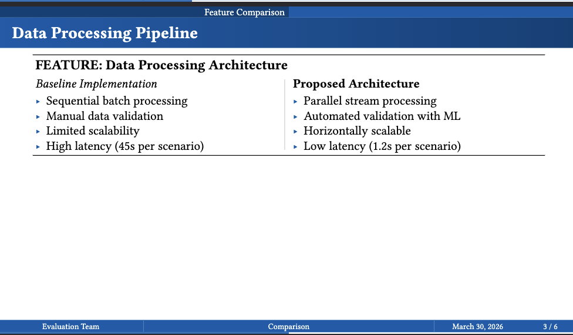

# Typst Academic Presentation Template

Professional academic presentation template with 40+ LaTeX-inspired components for research papers, technical talks, and data-driven presentations.



## Features



## Quick Start

1. **Copy an example** from `examples/` folder
2. **Edit the content** to match your needs
3. **Compile:** `typst compile presentation.typ`

## What's Included

- **40+ Components** - Code blocks, theorems, charts, tables, metrics
- **5 Examples** - Ready-to-use templates for different use cases
- **Academic Style** - Computer Modern fonts, booktabs tables, minimal colors
- **No Overflow** - Built-in content fitting and sizing

## Basic Structure

```typst
#import "@preview/touying:0.5.5": *
#import "@preview/clean-math-presentation:0.1.1": *
#import "lib/lib.typ": *

#show: clean-math-presentation-theme.with(
  config-info(
    title: [Your Title],
    authors: ((name: "Your Name", affiliation-id: 1),),
    affiliations: ((id: 1, name: "Your Institution"),),
    date: datetime.today(),
  ),
  progress-bar: true,
)

#title-slide()

= Section Name

#slide(title: "Slide Title")[
  #slide-content[
    Your content here
  ]
]
```

## Common Components

**Layout:**
```typst
#two-columns([Left], [Right])
#slide-split([Text], [Image])
```

**Code:**
```typst
#paper-code(caption: [Title])[```python
code here
```]
```

**Math:**
```typst
#paper-theorem(title: "Theorem 1")[Content with $math$]
#paper-proof[Proof steps]
#paper-algorithm(name: "Sort")[+ Step 1\n+ Step 2]
```

**Data:**
```typst
#paper-metric(title: "Speed", value: "1.2s", subtext: "Improved")
#paper-progress(percentage: 75, label: "Complete")
#paper-table(columns: (1fr, 1fr), headers: ("A", "B"), [1], [2])
```

**Images:**
```typst
#paper-figure(
  image("path.svg", fit: "contain"),
  caption: [Description]
)
```

**Emphasis:**
```typst
#paper-insight[Key takeaway message]
#callout(type: "info")[Important note]
#paper-badge("Valid", type: "success")
```

## Examples

Choose a starting point:

| Example | Preview | Description |
|---------|---------|-------------|
| `01-research-paper.typ` |  | Academic research with theorems |
| `02-code-heavy.typ` |  | Technical implementation |
| `03-data-visualization.typ` |  | Metrics and charts |
| `04-theorem-proof.typ` |  | Mathematical content |
| `05-comparison-study.typ` |  | Comparative analysis |

## File Structure

```
template/
├── lib/
│   ├── lib.typ              # Main import (use this)
│   ├── components.typ       # Layout & utility
│   ├── code-blocks.typ      # Code display
│   ├── theorem-boxes.typ    # Math & algorithms
│   └── charts.typ           # Data visualization
├── examples/                # 5 example presentations
├── images/                  # Placeholder images
├── map.json                 # Complete component reference
├── STEERING.md              # Detailed guide for AI agents
└── README.md                # This file
```

## Tips

1. **Prevent overflow:** Wrap content in `#slide-content[...]`
2. **Size images in grids:** Add `max-height: 30%` to `paper-figure`
3. **Always use:** `fit: "contain"` for images
4. **One idea per slide:** Keep slides focused
5. **Check map.json:** Complete component reference with examples

## Compilation

From template root:
```bash
typst compile presentation.typ
```

From examples folder:
```bash
typst compile --root .. 01-research-paper.typ
```

## Component Reference

See `map.json` for complete list of all 40 components with parameters and examples.

See `STEERING.md` for detailed usage guide and patterns.

See `examples/` for working presentations you can copy and modify.

## Design Principles

- **Typography:** Computer Modern font family
- **Colors:** Minimal - black, white, gray
- **Borders:** Sharp corners (0pt radius)
- **Tables:** Booktabs-style (no vertical lines)
- **Code:** 8pt monospace, light gray background
- **Math:** Italicized theorems, formal proofs with Q.E.D.

## License

MIT License - See LICENSE file

## Credits & Inspiration

This template is built upon and inspired by excellent work from the Typst community:

- **[Touying](https://github.com/touying-typ/touying)** (v0.5.5) - Powerful presentation framework for Typst
  - Provides the core slide system and presentation infrastructure
  - Created by the Touying team
  
- **[Clean Math Presentation](https://github.com/lucannez64/clean-math-presentation)** (v0.1.1) - Clean academic theme
  - Inspired the minimal, professional aesthetic
  - Provided the foundation for the academic styling
  - Created by Luca Salvarani

- **[JoshuaLampert/clean-math-presentation](https://github.com/JoshuaLampert/clean-math-presentation)** - Design inspiration
  - Inspired the clean, academic presentation style
  - Demonstrated effective use of minimal design principles
  - Created by Joshua Lampert

This template extends these foundations with 40+ custom academic components, comprehensive examples, and enhanced documentation for research and technical presentations.
## Need Help?

1. Check `map.json` for component details
2. Look at `examples/` for patterns
3. Read `STEERING.md` for comprehensive guide
4. Compile `example.typ` to see all components
